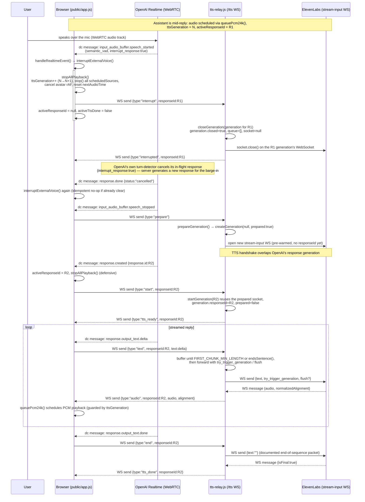

# Realtime Voice Agent: OpenAI Realtime + ElevenLabs

A low-latency, full-duplex voice assistant: OpenAI Realtime handles speech understanding,
turn-taking, and reasoning over WebRTC, while ElevenLabs' streaming TTS speaks the replies
in a cloned voice. The interesting engineering problem here isn't "call two APIs" — it's
keeping two independent streaming services in sync under interruption, so the user can barge
in mid-sentence and the whole pipeline (browser audio, OpenAI response, ElevenLabs generation)
tears down and restarts cleanly without stale audio playing.

## Why this is interesting

- **Two-way streaming pipeline, not request/response.** Audio flows browser → OpenAI over
  WebRTC; text deltas flow server → ElevenLabs over a WebSocket; PCM audio flows back to the
  browser for scheduled playback — three concurrent streams kept coherent per turn.
- **Interruption handling as a first-class concern** (`lib/tts-relay.js`): each assistant turn
  owns a `generation` object with its own socket and response ID. On interrupt, the current
  generation is marked closed and any in-flight ElevenLabs socket is torn down — buffered
  events from a superseded generation are checked against `isActive()` and discarded, so audio
  from a previous turn can never leak into a new one.
- **Latency shaving via connection pre-warming.** The server opens (and primes) the next
  ElevenLabs WebSocket as soon as the user stops speaking (`prepareGeneration`), hiding the
  TTS handshake inside OpenAI's response-generation time instead of paying for it serially.
- **Sentence-aware chunk flushing.** Text deltas are buffered until a minimum length or a
  sentence boundary (`endsSentence`), then flushed with ElevenLabs' `try_trigger_generation` /
  `flush` flags — trading a small amount of buffering for noticeably faster, more natural
  first-audio latency.
- **Server-side credential isolation.** Both API keys live only in `.env` on the server;
  the browser never sees them — the frontend only exchanges SDP/text over `/session` and `/tts`.

## How it works

The realtime path is:

1. The browser sends microphone audio directly to OpenAI Realtime over WebRTC.
2. OpenAI semantic VAD detects natural turn boundaries and interruptions.
3. OpenAI maintains the conversation and streams a text response.
4. The local server streams that text to ElevenLabs.
5. The browser schedules ElevenLabs PCM audio for low-latency playback.
6. If you begin speaking, queued audio and the active ElevenLabs generation stop immediately.

API keys stay on the server and are never sent in the public frontend files.

## Barge-in sequence

This is the actual event flow implemented across `public/app.js` (browser),
`server.js` / `lib/tts-relay.js` (relay), OpenAI Realtime (WebRTC data channel),
and ElevenLabs (WebSocket streaming TTS) when the user talks over the assistant
mid-reply. Function and event names below match the source directly.



Two guard rails make this safe under rapid, repeated interruption:

- **`isActive(generation)` on every ElevenLabs event** in `tts-relay.js` — a
  message from a socket that belongs to a superseded generation is dropped
  instead of being relayed, so audio from response R1 can never reach the
  browser labeled as R2.
- **`ttsGeneration` counter on the browser** — `queuePcm24k()` checks the
  generation the audio chunk arrived under against the current counter before
  scheduling playback, so even an already-in-flight chunk from before the
  interrupt is silently discarded rather than played.

## Requirements

- Node.js 20 or newer
- An OpenAI API key with Realtime access
- An ElevenLabs API key
- The ElevenLabs voice ID for your cloned voice

## Setup

Copy the example configuration and enter your credentials:

```bash
cp .env.example .env
npm install
```

```env
OPENAI_API_KEY=
ELEVENLABS_API_KEY=
ELEVENLABS_VOICE_ID=
PORT=3000
REALTIME_MODEL=gpt-realtime-2.1
REALTIME_VAD_EAGERNESS=high
```

Start the app:

```bash
npm start
```

Open `http://localhost:3000`, allow microphone permission, and press
**Start conversation**. If you change `PORT`, use that port in the URL instead.

The server exits with a clear message if a required setting is missing, a value
is invalid, or the configured port is already occupied.

## Natural turn-taking

`REALTIME_VAD_EAGERNESS=high` is the recommended setting for the lowest turn-end
latency. Available values are:

- `low` — gives longer pauses more time before ending your turn
- `medium` — balanced explicit setting
- `high` — responds quickly but may cut off a thoughtful pause
- `auto` — the default OpenAI behavior; currently equivalent to `medium`

After changing `.env`, restart the server.

## ElevenLabs output

The relay uses `eleven_flash_v2_5` with `pcm_24000` and a low-latency chunk
schedule. It begins generating from early text deltas and flushes completed
sentences, so speech starts before OpenAI finishes the full response. The app also
prepares the next ElevenLabs connection as soon as you stop speaking, overlapping
its handshake with OpenAI's response time. Each OpenAI response owns a separate
ElevenLabs generation. When a new response starts or you interrupt, the old
generation is closed and any delayed audio from it is discarded.

The **Debug events** panel reports time from the end of your turn to the OpenAI
response, first text, ElevenLabs readiness, and first audio. This makes it clear
which service is responsible if a particular turn feels slow.

## Verification

Run linting and automated tests together:

```bash
npm run check
```

Useful manual checks:

1. Have a normal multi-turn conversation.
2. Pause mid-sentence, then finish the thought.
3. Interrupt while the cloned voice is speaking.
4. Interrupt repeatedly and quickly.
5. End and restart the conversation several times.
6. Temporarily use an invalid API key and confirm that the UI reports the failure.

The automated tests cover configuration validation, initial text buffering,
response-ID isolation, stale audio rejection, and interruption cleanup in the TTS relay.

## Security

- Keep real credentials only in `.env`; it is ignored by Git.
- Keep `.env.example` limited to blank placeholders and non-secret defaults.
- Rotate a key immediately if it is ever committed, shared, or copied into logs.

## Tech stack

Node.js, Express, `ws` (WebSocket), OpenAI Realtime API (WebRTC + semantic VAD), ElevenLabs
streaming TTS (`eleven_flash_v2_5`, WebSocket streaming), vanilla JS/Web Audio API on the
frontend. Node's built-in test runner (`node --test`) covers config validation, first-chunk
buffering, response-ID isolation, and interruption cleanup in the TTS relay.

## What this demonstrates

Designing a real-time, stateful, multi-service streaming system with correct interruption
semantics — a harder problem than typical single-request LLM integrations, and directly
relevant to voice agents, live copilots, and any product where a user can talk over the AI.
